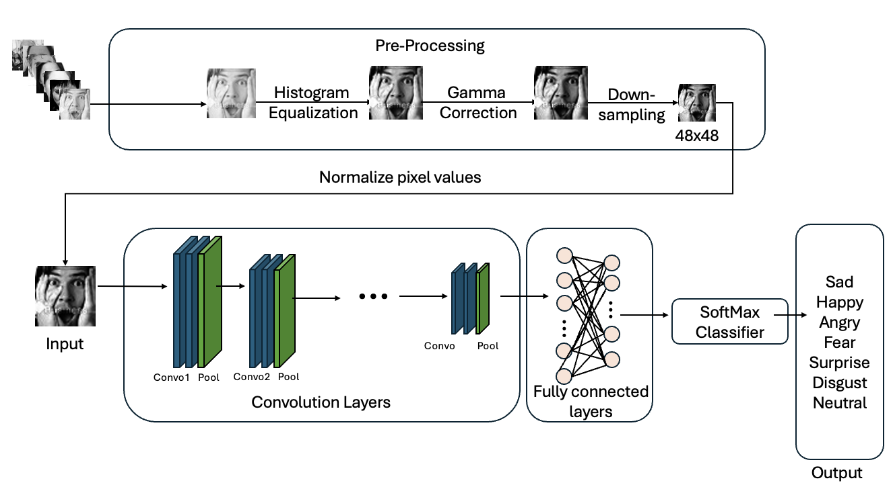

# Face Emotion Recognition

This project provides a reproducible pipeline for facial expression recognition: dataset preparation, model training, evaluation, and a simple web UI for inference. The system detects faces in input images, preprocesses the detected face regions, and classifies the expression using a trained CNN. A public deployment of this application is available here: [Face Emotion Recognition](https://faceemotionrecognition-yxzm4mgejhpplpwyn8pxuk.streamlit.app/)


## Setup

1. Create a Python environment (recommended):

```bash
python -m venv venv
source venv/bin/activate
```

2. Install dependencies:

```bash
python -m pip install -r requirements.txt
```

3. Run the Streamlit app from the project root:

```bash
streamlit run app.py
```

Notes:
- The project was developed with Python 3.8+. See `requirements.txt` for exact package versions.
- For GPU inference/training, ensure `torch` with CUDA support is installed and move model/tensors to CUDA.

## Model Specifications

- Architecture: convolutional neural network with convolutional + pooling blocks followed by fully connected layers and softmax output (see `model.py` for exact implementation).
- Input: single-channel (grayscale) images, default size 48×48 (verify preprocessing in `model.py`).
- Output: softmax probabilities over emotion classes (replace with the actual class list from `model.py`). Common label sets include: anger, disgust, fear, happiness, sadness, surprise, neutral.
- Pretrained Checkpoint: `model_cnn_bs32_lr0.001_epoch21.pt` — filename indicates training used batch size 32, learning rate 0.001, and the file was saved at epoch 21.

## Data Pipeline


**Source Dataset**
- FER-2013, which consists of 32,398 grayscale facial images (https://www.kaggle.com/datasets/msambare/fer2013).

**Preprocessing pipeline**
- Remove completely black images
- Histogram equalization (OpenCV `cv2.equalizeHist`) to enhance contrast.
- Gamma correction with gamma=0.9 to normalize illumination.
- Resize to 48×48 pixels (single channel).
- Convert to PyTorch tensors and normalize to range [-1, 1] via (x - 0.5) / 0.5.

**Data augmentation**
- RandomRotation ±10°
- RandomAffine with translate=(0.1, 0.1) and scale=(0.9, 1.1)
- RandomHorizontalFlip(p=0.5)

**Training**
- Model: CNN with 5 convolutional blocks (channels: 1→32→64→128→256→512), batch normalization, pooling, and two fully connected layers (hidden 256) with dropout.
- Loss: CrossEntropyLoss.
- Optimizer: AdamW with weight decay
- Hyperparameters used in experiments:
	- Learning rate: 0.001
	- Batch size: 32
	- Weight decay: 1e-4
    - epoch: 21
- Checkpointing: per-epoch checkpoint files are saved to a `checkpoints/` directory using a generated filename that encodes model name, batch size, learning rate, and epoch.

**Baseline and additional experiments**
- A baseline model using PCA (n_components=100) + SVM (RBF kernel, C=1.0, gamma='scale') was used for comparison.

## Discussion and Evaluation

Evaluation was done by computing overall accuracy, per-class accuracy, precision and recall, and plot a confusion matrix. The project evaluates both on an internal FER2013 test split and on an external CK+ test set (after label mapping and preprocessing).

**FER2013 (Test Set)**
Overall Accuracy: 66.72%
The model performs moderately well on the challenging FER2013 dataset. Performance varies significantly across emotions:
Best performing classes:
- Happy (84.73%)
- Surprise (79.83%)
Lowest performing class:
- Fear (45.70%)
The confusion matrix shows frequent misclassification between Fear, Sad, and Neutral, likely due to subtle and overlapping facial features. In contrast, highly expressive emotions like Happy and Surprise are easier to distinguish.

This suggests the model learns strong, macro-level facial patterns but struggles with subtle emotional cues.

**CK+ Dataset (Final Testing)**
Overall Accuracy: 83.16%
Performance improves significantly on CK+, likely because:
- Expressions are posed and exaggerated
- Images are cleaner and more controlled
- Less variation in lighting and background

However, some unusual observations:
- Happy achieved 100% recall, indicating strong detection of exaggerated expressions.
- Contempt returned NaN accuracy, likely due to class mismatch or absence in predictions.
- Sad showed very low precision (16.33%), suggesting confusion with other similar emotions.
This indicates the model performs better in controlled environments but is less robust in real-world conditions.

## Application

Prediction pipeline implemented by the Streamlit app follows these steps:

1. **Input acquisition**: user uploads an image or the app captures a webcam frame.
2. **Face detection**: detect face bounding boxes (e.g., using OpenCV Haar cascades); select the primary face (largest bounding box) for inference.
3. **Face cropping and preprocessing**: crop the detected face region, convert to grayscale, resize to 48×48, normalize, and convert to a tensor.
4. **Model inference**: load the pretrained checkpoint once at app startup, and run the forward pass.
5. **Post-processing**: select predicted class and confidence score, overlay bounding box and label on the image, and display results in the Streamlit UI.
